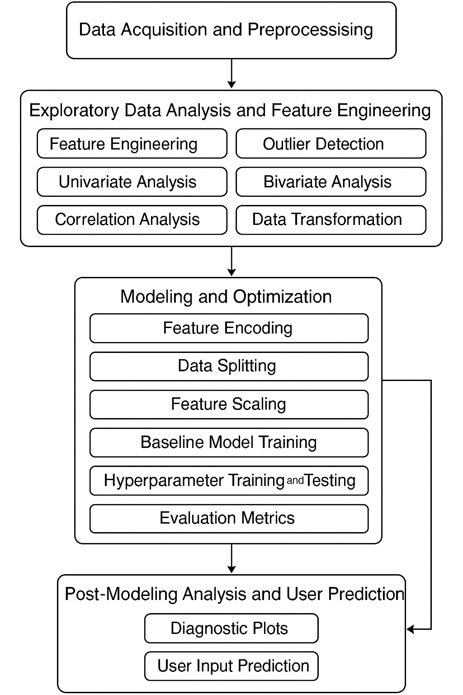
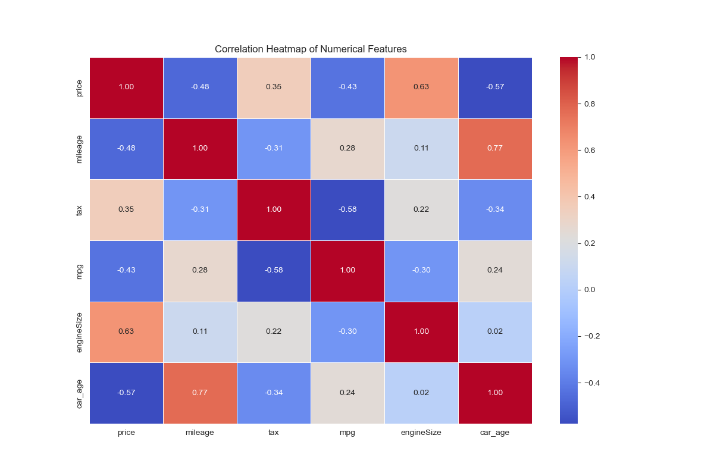
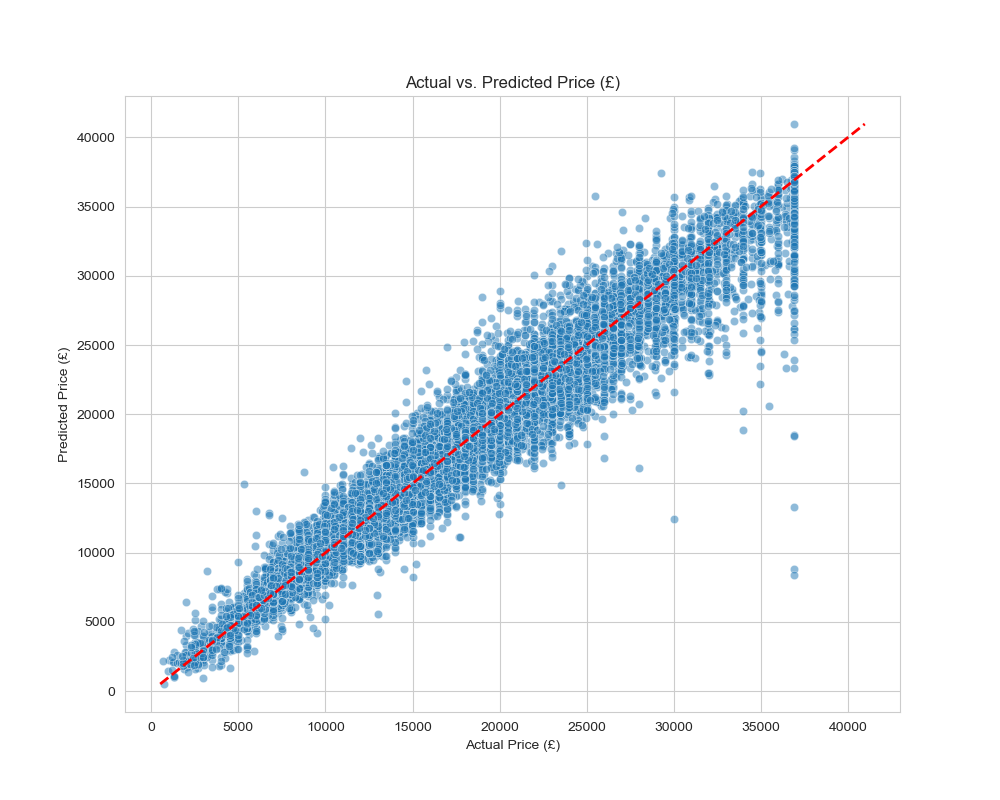
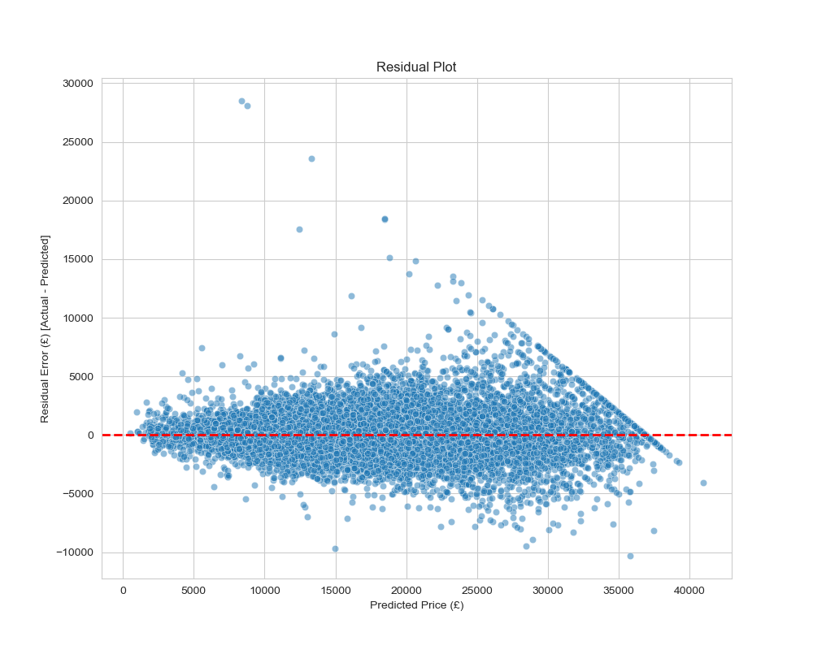
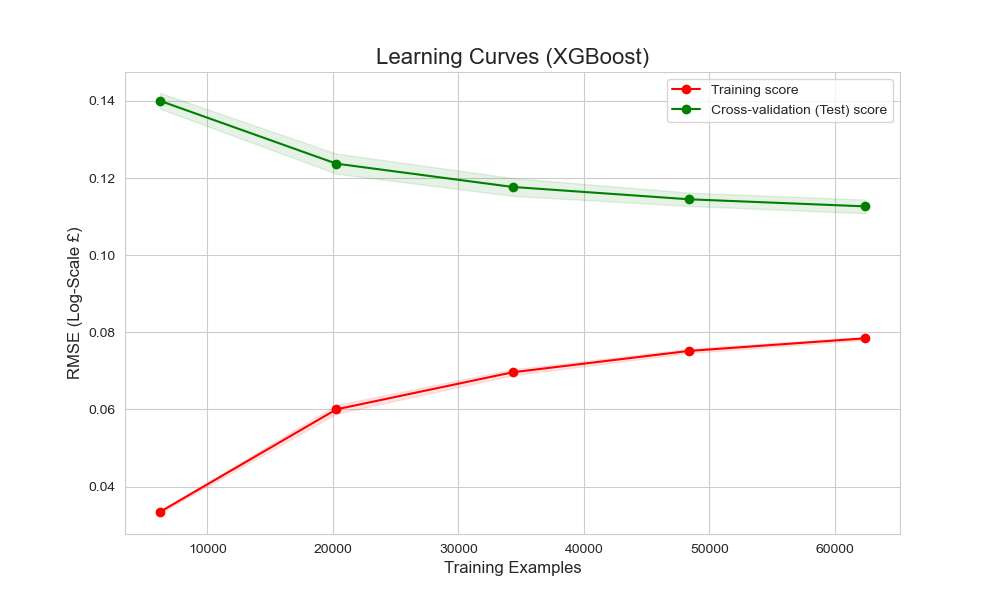

# Used Car Price Prediction – End-to-End ML Pipeline


A production-ready machine learning pipeline designed to predict used car prices with high precision. By harmonizing data from 9 separate sources and optimizing an **XGBoost Regressor**, this system achieves a **9.4% reduction in prediction error** compared to baseline models.

This project demonstrates **MLOps principles**: rigorous data engineering, automated pipeline design, and hyperparameter optimization for real-world deployment.

---

## Table of Contents
- [Project Overview](#project-overview)
- [Key Features](#key-features)
- [System Architecture](#system-architecture)
- [Data Engineering Pipeline](#data-engineering-pipeline)
- [Model Performance](#model-performance)
- [Tech Stack](#tech-stack)
- [Project Structure](#project-structure)
- [Sample Screenshots](#sample-screenshots)
- [Installation & Usage](#setup--installation)

---

## Project Overview

**The Problem:** The used car market suffers from high price volatility due to non-linear factors like mileage, age, and brand prestige. Traditional depreciation tables fail to capture these complex interactions, leading to mispricing.

**The Solution:** An automated valuation system that integrates regional datasets into a unified framework. It uses advanced feature engineering and ensemble learning to deliver accurate, data-driven price estimates.

**Impact:**
* **Unified Data View:** Merged 9 distinct datasets (Audi, BMW, Ford, etc.) into a single market view.
* **High Accuracy:** Tuned model explains **95.5%** of price variance ($R^2$).
* **Robustness:** Zero evidence of overfitting, confirmed by learning curve analysis.

---

## Key Features

* **Unified Data Pipeline:** Automated ingestion and harmonization of heterogeneous CSV files.
* **Advanced Preprocessing:**
    * **Skewness Correction:** Log-transform (`np.log1p`) applied to price and mileage.
    * **Outlier Handling:** Interquartile Range (IQR) capping to sanitize data.
    * **Feature Engineering:** Derived `Car Age` and depreciation metrics.
* **Ensemble Modeling:** Benchmarked 6 algorithms (Linear, Ridge, AdaBoost, LightGBM, CatBoost, XGBoost).
* **Hyperparameter Tuning:** Randomized Search optimization for the XGBoost engine.
* **Real-Time Inference:** Deployment-ready function for instant price prediction in local currency (INR/GBP).

---

## System Architecture

The pipeline follows a modular 4-stage architecture, designed for scalability and reproducibility.

<p align="center">
  
</p>

| Stage | Component | Description |
| :--- | :--- | :--- |
| **1** | **Ingestion** | Aggregates 9 brand datasets; aligns schemas and types. |
| **2** | **Processing** | Handles missing values, removes outliers, and standardizes features. |
| **3** | **Modeling** | Trains ensemble models; selects XGBoost via Cross-Validation. |
| **4** | **Inference** | Predicts price and converts output to user's currency. |

---

## Data Engineering Pipeline

The system implements a rigorous preprocessing workflow to ensure data quality:

1.  **Harmonization:** Merged inconsistent attributes (e.g., `tax` vs `tax(£)`) across 9 files.
2.  **Depreciation Logic:** Calculated `Car Age = Current Year - Registration Year`.
3.  **Winsorization:** Capped extreme outliers in `price` and `engineSize` using IQR thresholds.
4.  **Transformation:** Applied Logarithmic Transformation $$X' = \log(1 + X)$$ to normalize right-skewed distributions.
5.  **Scaling:** Standardized continuous features using Z-Score Normalization to prevent feature dominance.

---

## Model Performance

We conducted a two-stage evaluation: a baseline comparison of 6 algorithms followed by optimization of the winner.

### 1. Baseline Comparison (Test Set)
*XGBoost and CatBoost outperformed linear models significantly.*

| Model | Test $R^2$ | RMSE (£) | Status |
| :--- | :--- | :--- | :--- |
| **XGBoost** | **0.9485** | **£1,893.23** | **Selected** |
| **CatBoost** | 0.9481 | £1,901.60 | Runner-up |
| **LightGBM** | 0.9476 | £1,911.09 | Strong |
| **Random Forest** | 0.9415 | £2,019.26 | Overfit |
| **Linear Models** | ~0.8150 | ~£3,580.00 | High Bias |

### 2. Final Optimization Results
After hyperparameter tuning (RandomizedSearchCV), the model achieved:

| Metric | Baseline | **Final Tuned Model** | Improvement |
| :--- | :--- | :--- | :--- |
| **RMSE (£)** | £1,893.23 | **£1,715.30** | **📉 9.4% Error Reduction** |
| **$R^2$ Score** | 0.9485 | **0.9555** | **📈 Higher Accuracy** |

---

## Tech Stack

* **Language:** Python 3.8+
* **Modeling:** XGBoost, CatBoost, LightGBM, Scikit-Learn
* **Data Manipulation:** Pandas, NumPy
* **Visualization:** Matplotlib, Seaborn
* **Development:** Jupyter Notebook

---

## Project Structure
```text
.
├── assets/                              # Output plots and Diagrams  
├── dataset/
│   ├── used_cars/              
│   │   ├── audi.csv, bmw.csv...         # Raw CSV files (audi.csv, bmw.csv...)
│       └── preprocessed_used_cars.csv
├── used_car_prediction.ipynb            # Main Pipeline (ETL + Modeling)
└── README.md
```

---

## Sample Screenshots

### Correlation Matrix
*Heatmap displaying the relationships between numerical features. It helps identify highly correlated variables (multicollinearity) and their impact on the target price.*


### Actual vs. Predicted
*Visual proof of model accuracy. Points along the red line represent perfect predictions.*


### Residual Analysis
*Random scatter around zero indicates the model has captured all systematic patterns.*


### Learning Curves
*Demonstrates model convergence. The tight gap between the Training score (Red) and Cross-Validation score (Green) is the definitive proof that the model is **not overfitting**.*


---

## Setup & Installation

### 1. Clone the Repository
```bash
git clone [https://github.com/](https://github.com/)<your-username>/used-car-prediction.git
cd used-car-prediction
```

### 2. Install Dependencies
```bash
pip install pandas numpy scikit-learn xgboost matplotlib seaborn lightgbm catboost
```

### 3. Run the Pipeline
Open the notebook to execute the end-to-end workflow:

```bash
jupyter notebook used_car_prediction.ipynb
```

### 4. Example Inference Code
Use the provided function to predict the price of a new vehicle:

```python
new_car_input = {
    "year": 2017,
    "mileage": 15735,
    "tax": 150.0,
    "mpg": 55.4,
    "engineSize": 1.4,
    "brand": "Audi", 
    "transmission": "Manual",
    "fuelType": "Petrol"
}

# Predicts price in INR (converted from GBP)
final_price = predict_price_inr(new_car_input)
print(f"Estimated Market Value: ₹{final_price:,.2f}")
```

---

